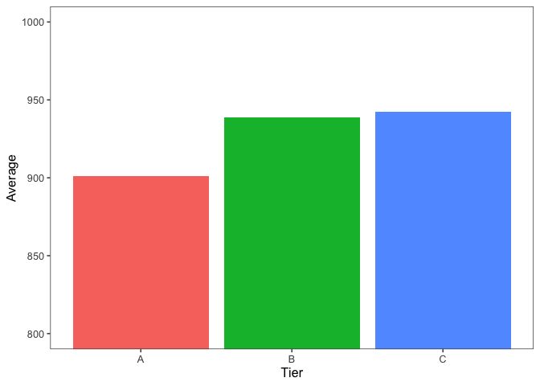
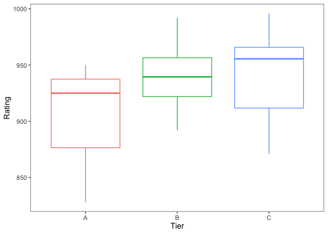
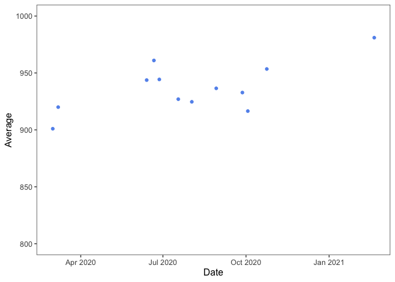
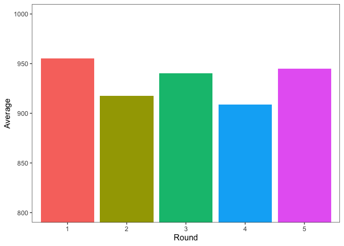

```r
pdga <- read_excel("~/Desktop/r/pdga.xlsx")
dallin.pdga <- read_excel("~/Desktop/r/dallin.xlsx")
```

## Background of my data

In disc golf, it can be very hard to find data.  I decided to look at my own data and see if I could find any trends.  Disc golf data is kept by the [PDGA](https://www.pdga.com) (Professional Disc Golf Association) so I went to my [own personal page](https://www.pdga.com/player/128966).  From there I simply copy and pasted my [ratings detail](https://www.pdga.com/player/128966/details).  This shows what makes up my current rating.  In order to have a little more to look at, I also took the data from the [best player in Idaho](https://www.pdga.com/player/72707), currently ranked 15th in the world, Dallin Blanchard.

For a quick understanding of what a rating is, you can take a look [here](https://www.pdga.com/ratings/guide), but essentially, every round played in a sanctioned event is evaluated and given a score.  A professional round is 1000 and that is what the system is based off.  One stroke is worth roughly 10 points, so you could expect that a player rated 990 would beat a player rated 950 by four strokes every 18 holes.  

The PDGA explains how average ratings work:
<style>
div.blue { background-color:#e6f0ff; border-radius: 5px; padding: 20px;}
</style>
<div class = "blue">

A player’s PDGA rating is based on rounds in the 12 months prior to the date of their most recently rated round. If a player has less than 8 rounds, the system will go back up to 24 months until it either finds 8 total rounds, or it will just use all rounds if less than 8. All members should receive a rating even if they only have one rated round. Almost all rounds are counted. Rounds more than 2.5 standard deviations or more than 100 points below a player’s average are dropped (about 1 in 50). The most recent 25% (1/4) of rounds will count double once there are at least 8 round ratings. This makes a player’s recent performance a bit more important. If a player does not complete a round (score shown as 999), it will not be included in their ratings round count.

## Quick look at the data


```r
nice_to_read <- pdga %>% 
  mutate(Date = as.character(pdga$Date))

datatable(nice_to_read)
```

<!--html_preserve--><div id="htmlwidget-7b97e363083d92d67aa2" style="width:100%;height:auto;" class="datatables html-widget"></div>
<script type="application/json" data-for="htmlwidget-7b97e363083d92d67aa2">{"x":{"filter":"none","data":[["1","2","3","4","5","6","7","8","9","10","11","12","13","14","15","16","17","18","19","20","21","22","23","24","25","26","27","28","29","30","31","32","33","34","35","36","37","38","39"],["Battle at the Bluff 2021 - Sponsored By RPM Discs","Battle at the Bluff 2021 - Sponsored By RPM Discs","2020 Cache Valley Classic Driven by Infinite Discs and Innova","2020 Cache Valley Classic Driven by Infinite Discs and Innova","Jolley's Ranch Open","Jolley's Ranch Open","2020 King of Idaho Falls presented by ICCU","2020 King of Idaho Falls presented by ICCU","2020 King of Idaho Falls presented by ICCU","2020 King of Idaho Falls presented by ICCU","2020 King of Idaho Falls presented by ICCU","The Preview at Snake River Landing presented by ICCU","The Preview at Snake River Landing presented by ICCU","ICCU Portneuf Valley Open presented by Infinite Discs","ICCU Portneuf Valley Open presented by Infinite Discs","ICCU Portneuf Valley Open presented by Infinite Discs","The Grove Classic Sponsored by ICCU","The Grove Classic Sponsored by ICCU","2020 Infinite Discs Davis County Open","2020 Infinite Discs Davis County Open","2020 Infinite Discs Davis County Open","Sward’s Ranch Classic 2020 - Driven by Innova","Sward’s Ranch Classic 2020 - Driven by Innova","The 2020 Lucky Disc Golf Open","The 2020 Lucky Disc Golf Open","The 2020 Lucky Disc Golf Open","The 2020 Lucky Disc Golf Open","Rock Creek Canyon Cup presented by Legacy Discs","Rock Creek Canyon Cup presented by Legacy Discs","MP40+ &amp; Amateur - The Memorial Championship presented by Discraft","MP40+ &amp; Amateur - The Memorial Championship presented by Discraft","MP40+ &amp; Amateur - The Memorial Championship presented by Discraft","Zions Bank Presents the Southeast Idaho Invitational Driven by Innova","Zions Bank Presents the Southeast Idaho Invitational Driven by Innova","Zions Bank Presents the Southeast Idaho Invitational Driven by Innova","Zions Bank Presents the Southeast Idaho Invitational Driven by Innova","2019 Montana State Championships","2019 Montana State Championships","2019 Montana State Championships"],["C","C","C","C","C","C","B","B","B","B","B","C","C","B","B","B","C","C","B","B","B","C","C","B","B","B","B","C","C","A","A","A","B","B","B","B","B","B","B"],["2021-02-20","2021-02-20","2020-10-24","2020-10-24","2020-10-03","2020-10-03","2020-09-27","2020-09-27","2020-09-27","2020-09-27","2020-09-27","2020-08-29","2020-08-29","2020-08-02","2020-08-02","2020-08-02","2020-07-18","2020-07-18","2020-06-27","2020-06-27","2020-06-27","2020-06-21","2020-06-21","2020-06-13","2020-06-13","2020-06-13","2020-06-13","2020-03-07","2020-03-07","2020-03-01","2020-03-01","2020-03-01","2019-10-19","2019-10-19","2019-10-19","2019-10-19","2019-09-15","2019-09-15","2019-09-15"],["1","2","1","2","1","2","5","1","2","3","4","2","1","1","2","3","1","2","3","1","2","1","2","2","3","Finals","1","1","2","3","1","2","1","2","3","4","2","3","1"],[47,54,63,61,82,83,92,59,57,61,59,59,66,57,62,58,47,56,54,53,53,65,64,55,55,61,50,56,63,56,68,80,57,59,70,55,57,73,62],[996,966,945,962,926,907,945,978,917,928,896,982,891,940,904,930,983,871,955,976,902,957,965,922,939,922,992,954,886,950,925,828,951,965,892,969,926,957,950],["Yes","Yes","Yes","Yes","Yes","Yes","Yes","Yes","Yes","Yes","Yes","Yes","Yes","Yes","Yes","Yes","Yes","Yes","Yes","Yes","Yes","Yes","Yes","Yes","Yes","Yes","Yes","Yes","Yes","Yes","Yes","Yes","No","No","No","No","No","No","No"],["Yes","Yes","Yes","Yes","Yes","Yes","Yes","Yes","Yes","Yes","Yes","Yes","Yes","Yes","Yes","Yes","Yes","Yes","Yes","Yes","Yes","Yes","Yes","Yes","Yes","Yes","Yes","Yes","Yes","Yes","Yes","No","No","No","No","No","No","No","No"]],"container":"<table class=\"display\">\n  <thead>\n    <tr>\n      <th> <\/th>\n      <th>Tournament<\/th>\n      <th>Tier<\/th>\n      <th>Date<\/th>\n      <th>Round<\/th>\n      <th>Score<\/th>\n      <th>Rating<\/th>\n      <th>Evaluated<\/th>\n      <th>Included<\/th>\n    <\/tr>\n  <\/thead>\n<\/table>","options":{"columnDefs":[{"className":"dt-right","targets":[5,6]},{"orderable":false,"targets":0}],"order":[],"autoWidth":false,"orderClasses":false}},"evals":[],"jsHooks":[]}</script><!--/html_preserve-->

## How ratings work

The PDGA explains how an average rating is created, and it is a little complicated.  Ratings are only included from events that happened in the past 12 months.  Also the most recent 25 percent are double counted.  Outliers are defined as ratings that are 2.5 standard deviations away from the mean or 100 points below the average.  These are dropped.

From the PDGA website:
<style>
div.blue { background-color:#e6f0ff; border-radius: 5px; padding: 20px;}
</style>
<div class = "blue">

A player’s PDGA rating is based on rounds in the 12 months prior to the date of their most recently rated round... Almost all rounds are counted. Rounds more than 2.5 standard deviations or more than 100 points below a player’s average are dropped (about 1 in 50). The most recent 25% (1/4) of rounds will count double once there are at least 8 round ratings. This makes a player’s recent performance a bit more important.

## Recreating my rating


```r
average_pdga <- function(df){
  df1 <- df %>% 
    select(Date, Rating) %>% 
    filter(Date >= max(Date) - years(1)) %>% 
    mutate(mean = mean(Rating)) %>% 
    mutate(deviation = abs(mean - Rating)) %>% 
    filter(deviation < 100) %>% 
    mutate(sd = sd(Rating) * 2.5) %>% 
    filter(deviation < sd) %>% 
    select(-deviation, -sd, -mean) %>% 
    rowid_to_column("ID") %>% 
    mutate(top25 = round(max(ID) / 4)) %>% 
    mutate(keep = top25 - ID) %>% 
    filter(keep >= 0) %>% 
    select(-keep, -top25, -ID)
  
  average <- df %>% 
    select(Date, Rating) %>% 
    rbind(df1) %>% 
    filter(Date >= Sys.Date() - years(1)) %>% 
    mutate(`Average Rating` = round(mean(Rating))) %>%
    select(`Average Rating`) %>%
    distinct()
  
  average
}

average_pdga(pdga)
```

```
## # A tibble: 1 x 1
##   `Average Rating`
##              <dbl>
## 1              943
```

This works like a charm.  If we go back to [my rating](https://www.pdga.com/player/128966), it is off by one.  Maybe the PDGA rounds down?  

Let's see if it also works for Dallin.


```r
average_pdga(dallin.pdga)
```

```
## # A tibble: 1 x 1
##   `Average Rating`
##              <dbl>
## 1             1031
```


The PDGA only updates ratings every month, and in the last month, I have played two rated rounds.  How is my rating going to change when the data are added from this month?


```r
Rating <- c(964, 968)
Date <- c("2021-03-20", "2021-03-20")

new <- data.frame(Date, Rating)

pdga_with_new_data <- pdga %>% 
  select(Date, Rating) %>% 
  rbind(new)

average_pdga(pdga_with_new_data)
```

```
## # A tibble: 1 x 1
##   `Average Rating`
##              <dbl>
## 1              944
```

I have a tournament coming up in a couple weeks.  If I play incredibly well how will that affect my rating?  In this case, incredibly well means two rounds rated 1000.


```r
Rating <- c(1000, 1000)
Date <- c("2021-04-17", "2021-04-17")

pdga_with_new_data1 <- pdga_with_new_data %>% 
  rbind(new)

average_pdga(pdga_with_new_data1)
```

```
## # A tibble: 1 x 1
##   `Average Rating`
##              <dbl>
## 1              946
```


## Questions to look at

Does tier matter?  Each tournament is given a tier for how large it is.  An A tier event is big, has many rounds, and has a lot of pressure.  A B tier is a medium sized event, and a C tier is a small event that will usually take place in one day.  The tier and the ratings are independent of each other, but is my play consistent? 


```r
pdga %>% group_by(Tier) %>% 
  mutate(Average = mean(Rating)) %>% 
  ungroup() %>% 
  select(Tier, Average) %>% 
  distinct() %>% 
  ggplot() +
  geom_bar(aes(x = Tier, y = Average, fill = Tier), 
           stat = "identity",
           show.legend = F) +
  coord_cartesian(ylim = c(800, 1000)) +
  theme_few()
```

<!-- -->

```r
pdga %>% group_by(Tier) %>% 
  ggplot() +
  geom_boxplot(aes(x = Tier, y = Rating, color = Tier), 
               show.legend = F) +
  theme_few()
```

<!-- -->


It looks like I play much worse in A Tier events and much better in smaller events, however I don't know if that is true.  Last year I only played in one A Tier and it was my first event after a long winter of no practice.  I feel that over the year, I got better and better.

That A Tier event took pace over a year ago, so it actually shouldn't even count in my rating, so from now on, we will only be looking at my events from the past year.

Let's take a look at the chart below.  We see that 


```r
pdga %>% filter(Date >= max(Date) - years(1)) %>% 
  group_by(Date) %>%
  mutate(Average = mean(Rating)) %>%
  ungroup() %>%
  select(Date, Average) %>%
  distinct() %>%
  ggplot() +
  geom_point(aes(x = Date, y = Average), 
           stat = "identity",
           show.legend = F, 
           color = "cornflowerblue") +
  coord_cartesian(ylim = c(800, 1000)) +
  theme_few()
```

<!-- -->

I have a friend who likes to talk about how my biggest issue is endurance.  He thinks that as I play in a tournament, I play worse the more rounds an event has.  Let's see if he is right.  
In the data, each round is assigned a number, but one round was assigned a character, "Finals".  Because I was there, I know that that "Finals" round was actually round 4.


```r
pdga$Round[26] = 4

pdga %>% filter(Date >= max(Date) - years(1)) %>% 
  group_by(Round) %>% 
  mutate(Average = mean(Rating)) %>% 
  ungroup() %>% 
  select(Round, Average) %>% 
  distinct() %>% 
  ggplot() +
  geom_bar(aes(Round, Average, fill = Round),
           stat = "identity", 
           show.legend = F) +
  coord_cartesian(ylim = c(800, 1000)) +
  theme_few()
```

<!-- -->


From the chart, it is clear that I do suffer from endurance issues.  Generally, a tournament will have two rounds in one day, so rounds 2 and 4 are often the second round of the day.  We see noticeably lower ratings during those afternoon rounds.  Often tournaments are just two rounds


```r
#needs work

# pdga %>% 
#   filter(Date >= max(Date) - years(1)) %>% 
#   group_by(Round) %>% 
#   mutate(`Number of Rounds` = count(as.factor(Rating))) %>% 
#   ungroup() %>% 
#   select(Round, `Number of Rounds`)
```


## Conclusions
